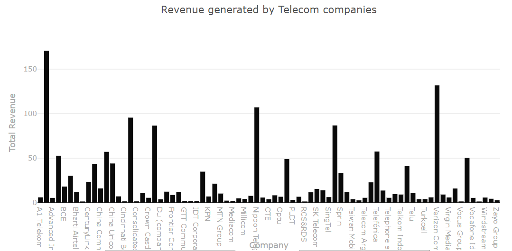

This is a dataset of leading telecom operators of the world

## Data
### List of mobile network operators:
Data is obtained from [List of Mobile Network Operators-Wikipedia](https://en.wikipedia.org/wiki/List_of_mobile_network_operators)
The data contains 
 
 * The overall rank of the mobile network company.
 * Their main markets.
 * Technology they use
 * Total Subscription
 * Ownership of the company
 This data can be viewed in telecom-operators.csv

### List of revenue generated by mobile network operators:
Data is obtained from [List of telephone companies -Wikipedia](https://en.wikipedia.org/wiki/List_of_telephone_operating_companies)
The data contains 
 
 * The overall rank of the mobile network company.
 * Name of the company
 * Total Revenue
 * Country of the company
 This data can be viewed in telecom-revenue.csv

### Other Good sources of data:
[GSMA Intelligence : Definitive data and analysis for the mobile industry](https://www.gsmaintelligence.com/)

Apparently they have all kind of data and research material about telecom operators

* Subscriber data
* Operational data
* Financial data
* Demographic Economic Data

**But signup required**

## Preparation
* The process.py and process-revenue scripts fetch data from table on wikipedia
* The data is extracted and cleaned in python and written to a csv file.
* Libraries used requests,beautifulsoup,csv

## License
[Public Domain Dedication and License v1.0](http://www.opendatacommons.org/licenses/pddl/1.0/)

## Visualization
The Revenue of Leading Telecom Companies

